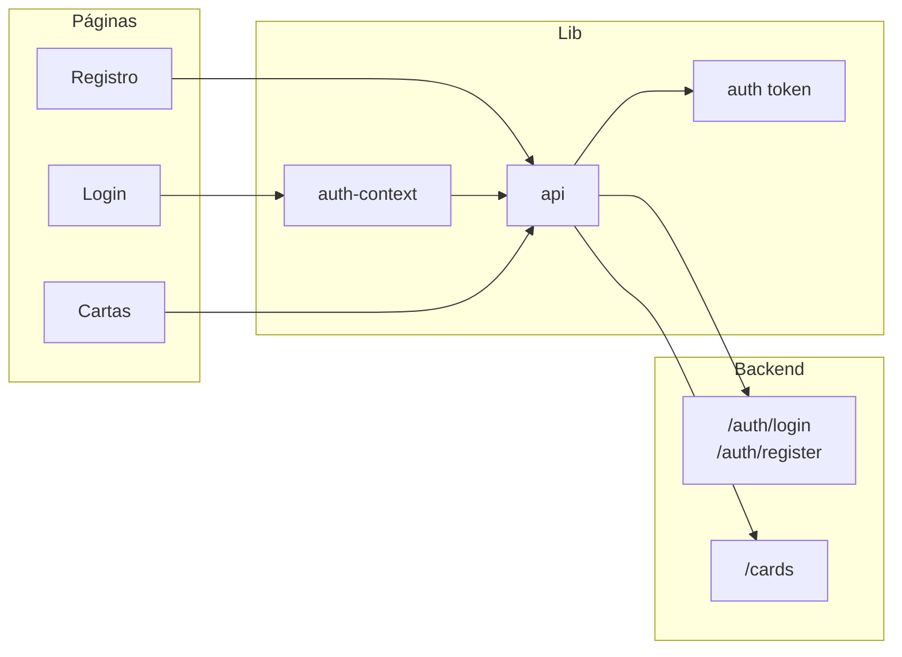

# Plano: Registro, login e consulta de cartas (Rift Bounty Frontend)

## Contexto

- Repositório atual: apenas `.git` (sem código).
- Backend: já existe ou estará pronto em breve (auth + cartas).
- Auth: JWT manual (formulário → API → guardar token).
- **Premissa:** o app deve funcionar em **deploy na Vercel**.

---

## 0. Compatibilidade com Vercel

- **Next.js:** o projeto será padrão Next.js (App Router), que a Vercel suporta nativamente; build e deploy sem configuração extra.
- **Variáveis de ambiente:** usar `NEXT_PUBLIC_API_URL` para a URL do backend; configurar no painel da Vercel (Settings → Environment Variables) para Production/Preview/Development. Não commitar `.env.local` (já no `.gitignore` do create-next-app).
- **Stateless:** auth com JWT no client (localStorage ou cookie) não exige sessão no servidor; funciona em ambiente serverless/edge da Vercel.
- **Chamadas à API:** todas as requisições são do **browser** para o **seu backend**; o backend precisa ter CORS liberando o domínio do front (ex.: `https://*.vercel.app` e o domínio customizado, se houver).
- **Nada de filesystem ou processo persistente no servidor:** não usar armazenamento em disco no frontend nem dependências que exijam Node longo; apenas fetch para API externa e estado no client — já alinhado ao plano.

Não é necessário `vercel.json` na primeira versão, a menos que você queira redirects ou headers específicos.

---

## 1. Inicializar o projeto Next.js

- Rodar `npx create-next-app@latest .` na raiz com:
  - **App Router** (sim)
  - TypeScript, ESLint, Tailwind CSS
  - `src/` opcional (recomendado: usar `src/app` para organizar)
  - Import alias `@/` para `src/`
- Criar `.env.local.example` com:
  - `NEXT_PUBLIC_API_URL=` (URL base do backend)

Resultado esperado: estrutura base com `app/`, `components/`, `public/`, `next.config.ts`, `tailwind.config.ts`.

---

## 2. Estrutura de pastas e rotas

```
src/
  app/
    layout.tsx          # Layout raiz + header com nav
    page.tsx            # Home (redirect ou landing simples)
    (auth)/
      login/page.tsx
      registro/page.tsx
    cartas/page.tsx     # Consulta de cartas (pública)
  components/
    ui/                 # Botões, inputs, card (reutilizáveis)
    layout/
      Header.tsx        # Logo, link Cartas, Login/Registro ou Logout
  lib/
    api.ts              # fetch wrapper + NEXT_PUBLIC_API_URL
    auth.ts             # getToken, setToken, removeToken, getUser (opcional)
    auth-context.tsx    # React Context: user, login, logout, loading
```

- **Rotas:** `/` (home), `/login`, `/registro`, `/cartas`.
- **Header:** sempre visível; “Cartas”; se não logado: “Login” e “Registro”; se logado: “Sair” (e opcional “Minha conta”).

---

## 3. Autenticação (JWT manual)

**3.1 Armazenamento do token**

- Guardar JWT em **cookie** (httpOnly se o backend enviar no Set-Cookie) ou em **localStorage** (se a API devolver o token no body). No plano assumimos que a API retorna `{ token: string, user?: {...} }` e o front guarda o token (ex.: `localStorage` ou cookie não-httpOnly para simplicidade). Documentar no código onde trocar para httpOnly quando o backend suportar.

**3.2 API e lib**

- `lib/api.ts`: função `apiClient` que usa `NEXT_PUBLIC_API_URL`, adiciona header `Authorization: Bearer <token>` quando existir token (ler de `lib/auth.ts`).
- `lib/auth.ts`: `getToken()`, `setToken()`, `removeToken()`. Se a API devolver dados do usuário no login, guardar em memória ou em cookie/localStorage (ex.: `user` no context).
- `lib/auth-context.tsx`: Provider com estado `user`, `loading`, funções `login(credentials)`, `logout()`. No `login` chamar POST para o endpoint de login, guardar token (e user se houver), atualizar context. No `logout` remover token e limpar user. Inicializar `user` a partir do token (opcional: endpoint “me” ou decode JWT só para exibir nome).

**3.3 Páginas de login e registro**

- `**/login`:** formulário (email, senha), submit → `login()` do context → em sucesso redirect para `/cartas` ou `/`, em falha exibir mensagem.
- `**/registro`:** formulário (nome, email, senha, confirmação de senha), submit → POST para endpoint de registro → em sucesso redirect para `/login` ou login automático (conforme contrato da API).

Contrato assumido da API (ajustar conforme seu backend):

- `POST /auth/login` → `{ token: string, user?: { id, name, email } }`
- `POST /auth/register` → `{ token?: string, user?: {...} }` ou só sucesso 201

---

## 4. Tela de consulta de cartas

- **Rota:** `/cartas` (pública; logado ou não).
- **Layout:** mesma header; área principal com filtros + lista/grid de cartas.

**4.1 Filtros (conforme “O que é o Rift Bounty”)**

- Campos sugeridos: nome (texto), set (select/search), raridade (select), domínio (select), tipo (select), atributos (ex.: multiselect ou tags). Enviar como query params na chamada à API (ex.: `GET /cards?name=...&set=...&rarity=...`).

**4.2 Listagem**

- Buscar cartas com `apiClient` (GET `/cards` ou path que o backend expuser). Estado: `cards`, `loading`, `error`. Exibir em grid de cards (imagem, nome, set, raridade, domínio, tipo, atributos principais). Paginação ou “carregar mais” se a API suportar.

**4.3 Contrato assumido da API de cartas**

- `GET /cards?name=&set=&rarity=&domain=&type=&...` → `{ data: Card[], total?: number }`
- `Card`: `id`, `name`, `imageUrl?`, `set`, `rarity`, `domain`, `type`, `attributes` (objeto ou array). Ajustar tipos TypeScript quando tiver o contrato exato.

---

## 5. Fluxo de dados (resumo)




---

## 6. Detalhes de implementação recomendados

- **Formulários:** estados locais (useState) ou react-hook-form + validação simples (ex.: zod) para não enviar dados inválidos.
- **Feedback:** loading nos botões de submit; mensagem de erro da API exibida em vermelho abaixo do form ou no topo da página.
- **Proteção de rotas:** não obrigatório na primeira versão; a home e `/cartas` são públicas. Se quiser páginas só para logados depois, usar no layout ou em um HOC/component que verifica o context e redireciona para `/login`.
- **Tipos:** criar `types/auth.ts` e `types/card.ts` com interfaces alinhadas ao backend; ajustar quando tiver o contrato real.

---

## 7. Ordem de implementação sugerida

1. Inicializar Next.js e configurar env (NEXT_PUBLIC_API_URL).
2. Criar `lib/api.ts` e `lib/auth.ts` e `lib/auth-context.tsx`; envolver o app com AuthProvider.
3. Implementar layout raiz e Header (links Cartas, Login, Registro, Logout conforme auth).
4. Implementar `/login` e `/registro` (formulários + integração com context e API).
5. Implementar `/cartas`: filtros + chamada GET à API + grid de cartas e tipos Card.
6. Ajustar contratos (tipos e paths) quando tiver a documentação ou exemplos reais da API.

---

## Arquivos principais a criar (após init)


| Arquivo                                   | Responsabilidade                                   |
| ----------------------------------------- | -------------------------------------------------- |
| `src/lib/api.ts`                          | Base URL, fetch, Authorization header              |
| `src/lib/auth.ts`                         | get/set/remove token (e user se guardar no client) |
| `src/lib/auth-context.tsx`                | Provider, login(), logout(), user                  |
| `src/app/layout.tsx`                      | Provider + Header                                  |
| `src/components/layout/Header.tsx`        | Nav + estado de auth                               |
| `src/app/(auth)/login/page.tsx`           | Form login                                         |
| `src/app/(auth)/registro/page.tsx`        | Form registro                                      |
| `src/app/cartas/page.tsx`                 | Filtros + lista de cartas                          |
| `src/types/card.ts` / `src/types/auth.ts` | Interfaces para API                                |


Se você tiver a URL base da API e os paths exatos (ex.: `/auth/login`, `/cards`), dá para fixar no plano ou nos comentários do código para não esquecer na implementação.