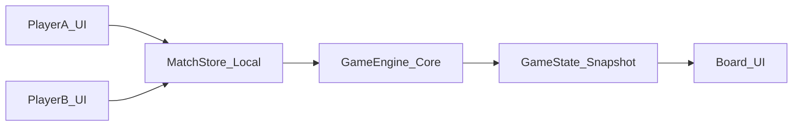

# Plano inicial — Simulador Riftbound (somente Front)

## Objetivo do MVP
Entregar uma primeira versão jogável com:
- reaproveitamento dos decks atuais do app (sem criar um segundo deck builder)
- partida 1v1 local (mesmo navegador)
- engine de regras simplificada (turno, fases e ações principais)

Sem ranking/login de jogo no primeiro corte, para ganhar velocidade e validar UX/gameplay.

## Base atual que vamos reaproveitar
- Cliente HTTP e proxy já prontos: [/root/projects/personal/riftbounty-frontend/src/lib/api.ts](/root/projects/personal/riftbounty-frontend/src/lib/api.ts) e [/root/projects/personal/riftbounty-frontend/src/app/api/proxy/[...path]/route.ts](/root/projects/personal/riftbounty-frontend/src/app/api/proxy/[...path]/route.ts)
- Modelo e fluxos de deck já maduros: [/root/projects/personal/riftbounty-frontend/src/lib/decks.ts](/root/projects/personal/riftbounty-frontend/src/lib/decks.ts) e [/root/projects/personal/riftbounty-frontend/src/types/deck.ts](/root/projects/personal/riftbounty-frontend/src/types/deck.ts)
- Catálogo/identidade de cartas e imagens: [/root/projects/personal/riftbounty-frontend/src/lib/cards.ts](/root/projects/personal/riftbounty-frontend/src/lib/cards.ts)
- Contexto/cache de cartas já pronto para busca/filtro e consumo global: [/root/projects/personal/riftbounty-frontend/src/lib/cards-context.tsx](/root/projects/personal/riftbounty-frontend/src/lib/cards-context.tsx)
- Já existe precedente de “simulador” no front (bom para padrões de UI/estado): [/root/projects/personal/riftbounty-frontend/src/components/events/pre-rift-simulator-section.tsx](/root/projects/personal/riftbounty-frontend/src/components/events/pre-rift-simulator-section.tsx) e [/root/projects/personal/riftbounty-frontend/src/lib/unleashed-pre-rift-sim.ts](/root/projects/personal/riftbounty-frontend/src/lib/unleashed-pre-rift-sim.ts)

## Arquitetura proposta de Front (incremental)

## Fases de implementação no front

### Fase 1 — Fundação do domínio de jogo
Criar um núcleo independente de UI para evitar retrabalho quando migrar para online:
- `src/features/simulator/core/` com:
  - `game-types.ts` (tipos: jogador, zona, fase, ação, estado)
  - `game-engine.ts` (reducer puro: aplica ação e retorna novo estado)
  - `rules-basic.ts` (regras simplificadas do MVP)
  - `game-seed.ts` (estado inicial de partida a partir dos decks)
- `src/features/simulator/core/__tests__/` com testes de engine (turno, compra, energia, ataque, fim de turno)

### Fase 2 — Adapter dos recursos atuais (cartas + decks)
Conectar o jogo aos recursos já existentes, evitando telas duplicadas:
- manter CRUD de deck em `/decks` e criar camada `src/features/simulator/decks/` para adaptar `Deck` -> `GameDeck`
- criar fluxo de “Escolher 2 decks existentes para iniciar partida local”
- reaproveitar busca/catálogo atual para inspeção de cartas durante setup e partida (tooltip/preview)
- só adicionar campos novos no backend se a estrutura de deck atual não cobrir algum requisito mínimo da partida

### Fase 3 — Partida 1v1 local
Subir tela principal de jogo local:
- `src/app/simulator/match/local/page.tsx`
- `src/features/simulator/ui/` com componentes de mesa (mão, campo, descarte, log de ações, controles de turno)
- store local (React state + reducer) conectada ao `game-engine.ts`
- controles para alternar jogador ativo e bloquear ações inválidas por fase

### Fase 4 — Telemetria de produto e UX
- eventos mínimos para entender uso: iniciar partida, duração, ações por turno, abandono
- feedback visual de fase/ação válida
- histórico curto de ações para debugar regras e reportes

## Escopo explícito deste plano
- este plano cobre apenas desenvolvimento Frontend
- responsabilidades e contrato de Backend ficam no documento `docs/SIMULADOR_RIFTBOUND_MVP.md` e no plano específico do repositório backend

## Critérios de pronto do MVP
- usuário seleciona dois decks existentes do app
- inicia partida local 1v1
- jogo avança em turnos/fases sem quebrar regras básicas
- ações inválidas são bloqueadas com mensagem clara
- testes de engine cobrindo fluxo principal de partida

## Riscos e mitigação
- Ambiguidade de regras oficiais: começar com “regras básicas explícitas” e feature flags para evolução
- Acoplamento com UI: engine 100% pura e testada fora do React
- Evolução para online: manter fronteiras de domínio claras (engine/adapter/ui) para reduzir retrabalho

## Entrega incremental sugerida
1. Engine + testes
2. Adapter para reaproveitar decks/cartas existentes no setup da partida
3. Mesa local jogável
4. Polimento de UX + instrumentação
