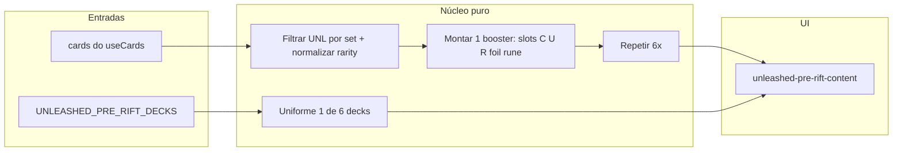

# Simulador de abertura (Pre-Rift + 6 boosters UNL)

## Viabilidade

**Sim.** O frontend já tem:

- Os **6 mini-decks** e a promo em `[src/data/unleashed-pre-rift-decks.ts](src/data/unleashed-pre-rift-decks.ts)` (`UNLEASHED_PRE_RIFT_DECKS`, `UNLEASHED_PRE_RIFT_PROMO`).
- A página do evento em `[src/app/events/unleashed-pre-rift/unleashed-pre-rift-content.tsx](src/app/events/unleashed-pre-rift/unleashed-pre-rift-content.tsx)` com `useCards()` para resolver cartas.
- Filtro de set Unleashed via `[getCardSetFilterValue](src/lib/card-set.ts)` → código `**UNL`** (alinhado a `/cards?set=UNL` e collector `UNL-`*).
- Raridades usadas no app: `common`, `uncommon`, `rare`, `epic`, `showcase` (normalizar `overnumbered` → `showcase` como em `[src/app/[slug]/page.tsx](src/app/[slug]/page.tsx)`).

**Limitações honestas (a documentar na UI):**

- A Riot **não publica** a colagem exata dos boosters; regras tipo “Epic ~1 em 4 displays” e “alt art ~1 em 144” são **estatísticas agregadas**, não um modelo por pacote verificável. O simulador será **heurístico / ilustrativo**.
- O tipo `Card` não modela “foil” como SKU separado no snippet lido; o mais simples é **marcar uma carta sorteada como foil na UI** (badge/estilo), sem segunda linha no catálogo.
- **Tokens** vs **runas**: filtrar por `type` (e possivelmente `record_type` se necessário) no pool UNL; se o catálogo tiver poucos itens nesse slot, pode haver fallback ou exclusão de tipos inválidos para aquele slot.
- Sorteio **i.i.d.** por slot pode gerar pools “estranhos” (muitas cópias da mesma comum); opcionalmente **amostragem sem reposição dentro de cada raridade** até esgotar o pool virtual (limitado ao tamanho do catálogo) — trade-off entre simplicidade e realismo.

## Abordagem técnica

1. **Módulo de simulação (testável)** — novo arquivo, ex.: `[src/lib/unleashed-pre-rift-sim.ts](src/lib/unleashed-pre-rift-sim.ts)` (ou `src/lib/sim/unleashed-booster.ts`):
  - `normalizeRarity(raw: string | undefined): string`
  - Particionar cartas UNL em arrays por raridade + bucket **token/rune** (função `isTokenOrRune(card)` baseada em `type` / convenções do projeto).
  - `drawOne<T>(pool: T[], rng)`: índice aleatório; validar pools não vazios (se vazio, degradar com mensagem ou usar pool mais amplo — definir comportamento explícito).
  - **Um booster (14 cartas)**:
    - 7× common, 3× uncommon (sorteio do respectivo pool).
    - 2× “rare slots”: começar como rare; com probabilidade configurável (ex. ~25% **por pacote** para pelo menos um epic, ou por slot — documentar a escolha) promover para epic; chance muito baixa (ex. `1/144` ou menor por slot) para **showcase** no lugar de rare/epic, alinhado ao que o usuário descreveu como referência, não como garantia legal.
    - 1× **foil**: sortear qualquer carta de um pool “boosterable” (ex. excluir apenas tokens se a regra for “foil de carta jogável”) e setar flag `isFoil: true`.
    - 1× **token/rune**: sortear só do bucket token/rune UNL.
  - `simulatePreRiftOpening(cards: Card[], rng?: seedable)`: retorna `{ miniDeckIndex, miniDeck, packs: BoosterPack[] }` onde cada carta no resultado referencia `Card` + metadados (`isFoil`, opcional `slotKind`).
2. **UI na página do evento** — em `[unleashed-pre-rift-content.tsx](src/app/events/unleashed-pre-rift/unleashed-pre-rift-content.tsx)` (ou componente filho dedicado, ex. `PreRiftSimulatorSection.tsx`):
  - Botão **“Simular pool”** / **“Abrir de novo”**.
  - Bloco de resultado: mini-deck escolhido (título + miniaturas reutilizando `PreRiftCardThumb` onde couber).
  - Seis “pacotes” colapsáveis ou em abas: grid de `CardTile` / thumb existente + indicador de foil.
  - Texto curto de **disclaimer** (PT/EN) nas chaves `[events.unleashedPreRift.](src/locales/pt-BR.json)`* / `[en.json](src/locales/en.json)`.
3. **RNG**: `Math.random()` é suficiente para brincadeira; opcional **seed** na querystring para compartilhar “mesma abertura” (nice-to-have, não obrigatório no MVP).
4. **Acessibilidade / performance**: simulação só após `cards.length` pronto; botão desabilitado enquanto catálogo vazio; não bloquear render da página inteira.

## Escopo fora do MVP (opcional depois)

- Estatísticas agregadas (“média de epics em 1000 runs”).
- Sem reposição global entre os 6 boosters para imitar melhor “caixa”.
- Integração com link para cada carta no catálogo (`/cards?set=UNL&q=…`).

## Ficheiros principais a tocar

| Ficheiro                                                                                             | Alteração                                          |
| ---------------------------------------------------------------------------------------------------- | -------------------------------------------------- |
| Novo `src/lib/unleashed-pre-rift-sim.ts`                                                             | Lógica de pools + sorteio                          |
| Novo `src/components/events/pre-rift-simulator-section.tsx` (opcional)                               | UI isolada                                         |
| `[unleashed-pre-rift-content.tsx](src/app/events/unleashed-pre-rift/unleashed-pre-rift-content.tsx)` | Inserir secção + estado                            |
| `[pt-BR.json` / `en.json](src/locales/pt-BR.json)`                                                   | Strings + disclaimer                               |
| Testes (opcional recomendado)                                                                        | `unleashed-pre-rift-sim.test.ts` com RNG fixo/mock |

